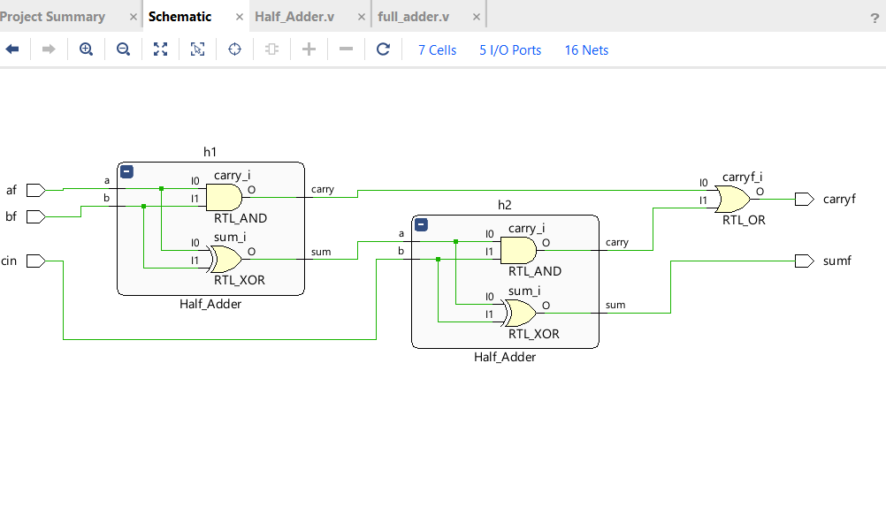
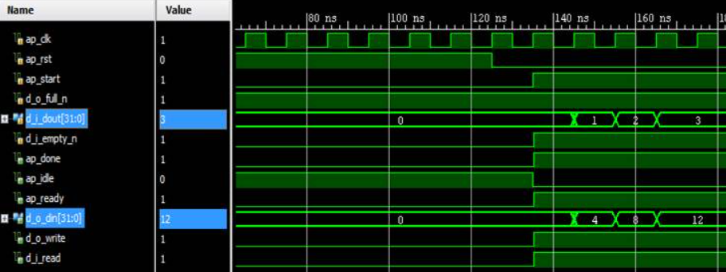

# Combinational Logic Design & Verification Portfolio

This folder contains the synthesizable RTL source code for foundational combinational logic circuits. Every module has been implemented using Verilog HDL and verified via structured simulation to demonstrate clean data-path routing, arithmetic computation, and logic optimization.

---

## 📑 Circuit Specifications & Modules

### 1. Basic Arithmetic: Half Adder & Full Adder
* **Half Adder (`Half_Adder.v`):** Computes the basic sum and carry bits from two single-bit binary inputs.
* **Full Adder (`full_adder.v`):** Processes three single-bit inputs (including a carry-in bit) to output an optimized sum and carry-out signal.

### 2. Scaled Arithmetic: Ripple Carry Adder
* **Module (`ripple_carry.v`):** Demonstrates modular structural hardware design. This module cascades multiple Full Adders in series to perform multi-bit binary addition, showcasing how carry signals propagate through chained hardware blocks.

### 3. Data Routing: 4:1 Multiplexer
* **Module (`mux_4_1.v`):** Implements a behavioral data selector that dynamically routes one of four input lines to a single output based on a 2-bit selection control signal sequence.

### 4. Magnitude Evaluation: 2-bit Digital Comparator
* **Module (`two_bit_comp.v`):** Evaluates the relative magnitudes of two separate 2-bit binary vectors to concurrently determine Greater-Than ($A > B$), Less-Than ($A < B$), and Equal-To ($A = B$) conditions.

---

## 💻 Simulation & Verification Flow

Every hardware module in this directory follows standard industry-level design steps:
1. **RTL Entry:** Writing clean, synthesizable behavioral or structural Verilog models.
2. **Functional Simulation:** Applying targeted test vectors to verify the circuit's truth-table specifications.
3. **Waveform Debugging:** Verifying data transitions using simulation trace waveforms.

---

## 📸 Vivado Simulation Waveforms

Below are the functional simulation results captured directly from the AMD Xilinx Vivado Simulator, providing empirical verification of the underlying hardware logic architectures.

### 1. Full Adder (Hierarchical Structural Simulation)
The simulation trace demonstrates accurate binary addition across varying input bit states, proving the structural integrity of the cascading gates.

### 2. 4:1 Multiplexer Behavioral Simulation
This trace verifies the data routing path. As the select lines toggle, the output transitions exactly to match the targeted data line stimulus.

### 3. 2-bit Digital Comparator Logic Trace
The output lines dynamically transition to reflect true relational behavior ($A > B$, $A < B$, or $A = B$) across the vector input sweep.

